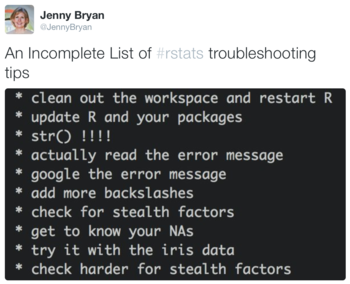

Get replies and quotes of a tweet
================
jenny
Fri Mar 4 23:21:16 2016

 I [tweeted some \#rstats troubleshooting tips](https://twitter.com/JennyBryan/status/704779515558400000), that were at least semi-serious. It seemed to strike a chord. As [Clint Weathers aka @zenrhino](https://twitter.com/zenrhino/status/704791544054722564) pointed out, there is solace in "shared suffering". The replies are pretty funny and wise, so this was a good excuse to make my first -- and possibly last! -- foray into the Twitter API, in order to get them. Load some packages.

``` r
library(twitteR)
library(purrr)
suppressMessages(library(dplyr))
library(stringr)
library(googlesheets)
```

I used the `twitteR` package ([CRAN](https://cran.r-project.org/web/packages/twitteR/index.html), [GitHub](https://github.com/geoffjentry/twitteR)) to access the [Twitter REST API](https://dev.twitter.com/rest/public). The [vignette](http://geoffjentry.hexdump.org/twitteR.pdf) contains some setup information. FWIW: I found that was necessary to set the callback URL for the app to `http://127.0.0.1:1410`. I put the various pieces of secret information in a file to keep them out of this script.

``` r
source("secrets.R")
setup_twitter_oauth(consumer_key = to$ck, consumer_secret = to$cs,
                    access_token = to$at, access_secret = to$as)
```

    ## [1] "Using direct authentication"

Hi, me!

``` r
jenny <- getUser("jennybryan")
(jenny_id <- jenny$getId())
```

    ## [1] "2167059661"

Find the [tweet of interest](https://twitter.com/JennyBryan/status/704779515558400000).

``` r
zz <- searchTwitter('from:jennybryan+troubleshooting', n = 5)
```

    ## Warning in doRppAPICall("search/tweets", n, params = params,
    ## retryOnRateLimit = retryOnRateLimit, : 5 tweets were requested but the API
    ## can only return 1

``` r
(target_tweet <- zz[[1]])
```

    ## [1] "JennyBryan: An Incomplete List of #rstats troubleshooting tips https://t.co/OKKoGkSYzq"

``` r
(target_tweet_id <- target_tweet$getId())
```

    ## [1] "704779515558400000"

How do I get all the replies? Jeroen put me onto this [SO thread](http://stackoverflow.com/questions/2693553/replies-to-a-particular-tweet-twitter-api), which suggests the API doesn't really support that. But it does contain constructive advice for a workaround:

-   get the user's id
-   get tweets from that user's mentions\_timeline
-   get the id of tweet of interest
-   filter user's mentions for tweets where `in_reply_to_status_id` matches this id

Let's try that.

``` r
mt <- mentions(n = 200, sinceID = target_tweet_id)
length(mt)
```

    ## [1] 120

``` r
tail(mt)
```

    ## [[1]]
    ## [1] "joncgoodwin: @JennyBryan \"actually read the error message\" is kind of asking a lot."
    ## 
    ## [[2]]
    ## [1] "davidascher: @JennyBryan yeah, so i'd say a file watcher (pick your language) spawning convert on new-file or file-change events."
    ## 
    ## [[3]]
    ## [1] "biocs: @JennyBryan using a command-line interface maid (https://t.co/uxB9Ef2FBw) plus ImageMagick should work (and it’s free, in contrast to Hazel)"
    ## 
    ## [[4]]
    ## [1] "mikelove: @JennyBryan ok I know you said incomplete but... ;-) if you've got anything in .Rprofile, try R --no-init-file"
    ## 
    ## [[5]]
    ## [1] "AmeliaMN: @JennyBryan is this at all related to the fact that Grab only makes tiffs?"
    ## 
    ## [[6]]
    ## [1] "gvwilson: @JennyBryan \"Stealth factors\"? How come *my* programming language doesn't have those? Huh."

A couple of helper functions. Nothing to see here.

``` r
map_chr2 <- function(x, .f, ...) {
  map(x, .f, ...) %>% map_if(is_empty, ~ NA_character_) %>% flatten_chr()
}
ellipsize <- function(x, n = 20) {
  ifelse(str_length(x) > n,
         paste0(str_sub(x, end = n - 1), "\u2026"),
         str_sub(x, end = n)) %>%
    str_pad(n)
}
```

Put the mention tweets in a data frame. Pull out `replyToSID`. Filter for the target tweet.

``` r
df <- data_frame(mt = mt) %>%
  mutate(replyToSID = mt %>% map_chr2("replyToSID")) %>%
  filter(replyToSID == target_tweet_id)
df %>%
  mutate(id = mt %>% map_chr2("id"),
         screenName = mt %>% map_chr2("screenName"),
         text = mt %>% map_chr2("text")) %>%
  mutate(text = text %>% substr(13, 140) %>% trimws() %>% ellipsize(30)) %>%
  select(-replyToSID, -mt)
```

    ## Source: local data frame [20 x 3]
    ## 
    ##                    id      screenName                             text
    ##                 (chr)           (chr)                            (chr)
    ## 1  704815949845819394          tjmahr   this is great. I hit ctrl shi…
    ## 2  704811393074249728    pasqui_dente                          class()
    ## 3  704808779997548545 henrikbengtsson       "help the helper help you"
    ## 4  704805308909146112      Chr_Koenig   "add more backslashes" ... ju…
    ## 5  704792060277223426         jalapic   add another pair of square br…
    ## 6  704792033672560640        helsouth   also - use with() instead of …
    ## 7  704789956074471424        ecpolley   * Check for converted variabl…
    ## 8  704789353944506368 eric_normandeau   @sjackman nothing about trace…
    ## 9  704787631016534016          pssGuy            * contact @JennyBryan
    ## 10 704784872364228608       thomasp85   Just throwing one in. Add dro…
    ## 11 704784811999825921     Gaming_Dude      as.numeric(as.character(f))
    ## 12 704784680726319105    scottistical   @hadleywickham 1. Curse 2. Bl…
    ## 13 704784299929706496    RallidaeRule   can I share this with my stud…
    ## 14 704784225799634945   HelicityBoson   @hadleywickham stealth factor…
    ## 15 704783992755769344    BrownJosephW  @ethanwhite Add:\n* tweet to #…
    ## 16 704782595159011328       optimlog_   package conflicts: dplyr plyr…
    ## 17 704781813512695808        zenrhino  Mine:\nRule #1: Read the instr…
    ## 18 704780561085104128     joncgoodwin   "actually read the error mess…
    ## 19 704780379320934400        mikelove   ok I know you said incomplete…
    ## 20 704780174001364997        gvwilson   "Stealth factors"? How come *…

That filter may be too draconian. Some of the tweets I want to include are replies to replies. Those *should* still show up in my mentions so I think I'll just keep all mentions that are recent enough and manually curate.

``` r
df <- data_frame(mt = mt) %>%
  mutate(replyToSID = mt %>% map_chr2("replyToSID"))
mentions <- df %>%
  mutate(id = mt %>% map_chr2("id"),
         screenName = mt %>% map_chr2("screenName"),
         text = mt %>% map_chr2("text")) %>%
  select(-replyToSID, -mt)
mentions %>%
  mutate(text = text %>% substr(13, 140) %>% trimws() %>% ellipsize(37))
```

    ## Warning in stri_length(string): invalid UTF-8 byte sequence detected.
    ## perhaps you should try calling stri_enc_toutf8()

    ## Warning in stri_length(string): invalid UTF-8 byte sequence detected.
    ## perhaps you should try calling stri_enc_toutf8()

    ## Warning in stri_length(string): invalid UTF-8 byte sequence detected.
    ## perhaps you should try calling stri_enc_toutf8()

    ## Warning in stri_length(string): invalid UTF-8 byte sequence detected.
    ## perhaps you should try calling stri_enc_toutf8()

    ## Warning in stri_length(string): invalid UTF-8 byte sequence detected.
    ## perhaps you should try calling stri_enc_toutf8()

    ## Warning in stri_length(string): invalid UTF-8 byte sequence detected.
    ## perhaps you should try calling stri_enc_toutf8()

    ## Warning in stri_length(string): invalid UTF-8 byte sequence detected.
    ## perhaps you should try calling stri_enc_toutf8()

    ## Source: local data frame [120 x 3]
    ## 
    ##                    id screenName                                  text
    ##                 (chr)      (chr)                                 (chr)
    ## 1  705963994977333249 bhaskar_vk  @AmeliaMN That is really really sad.
    ## 2  705963145702084608   AmeliaMN uuugh. so you're saying I have thing…
    ## 3  705950403704201216  sleight82 @UWCSSS dang. Been following from af…
    ## 4  705949598171303936      jrnld        @JennyBryan Want to do dinner?
    ## 5  705941645062217729    PBarmby I am totally figuring out how to wor…
    ## 6  705934677761101826 treycausey @UWCSSS Argh, I cannot make your tal…
    ## 7  705800022474911745     UWCSSS @JennyBryan on Happy Git and GitHub …
    ## 8  705789525348507649     lapply I was looking for a dataset for a gg…
    ## 9  705586264926388224 treycausey @kwbroman @hadleywickham "Assume for…
    ## 10 705525090902011904 sjmgarnier                That's not helpful :-)
    ## ..                ...        ...                                   ...

Clearly I will be in for some pain if I need to work with text with emoji. Hopefully those will get filtered out and I can ignore this problem!

Write `mentions` to a Google Sheet for manual curation. I tried with Excel locally but it mangled the tweet ids and line endings, as usual, whereas Google did not.

``` r
# initial creation
# ss <- gs_new("mentions_for_manual_curation", trim = TRUE,
#              input = mentions %>%
#                mutate(keep = FALSE) %>%
#                select(id, screenName, keep, text))
ss <- gs_title("mentions_for_manual_curation")
```

    ## Sheet successfully identified: "mentions_for_manual_curation"

``` r
ss %>% gs_browse()
```

    ## NULL

``` r
(n_curated <- ss$ws$row_extent - 1) # there's a header row
```

    ## [1] 120

``` r
if (nrow(mentions) > n_curated && interactive()) {
  mentions_curated <- ss %>%
    gs_read(col_types = "cclc")
  mentions_for_curation <- mentions %>%
    left_join(mentions_curated %>% select(id, keep)) %>%
    select(id, screenName, keep, text)
  ss <- ss %>%
    gs_edit_cells(input = mentions_for_curation)
  message("Tweets needing a keep decision: ",
          sum(is.na(mentions_for_curation$keep)))
  ## I manually worked on the `keep` column in the browser at this point
  mentions <- ss %>%
    gs_read(col_types = "cclc") %>%
    filter(keep)
}
```

I also noticed that anyone who *quoted* the tweet wasn't showing up in the mentions. How do I get those tweets? Because the added comments are basically the same as these replies. Back to [stackoverflow](http://stackoverflow.com/questions/31373259/how-to-find-all-retweet-with-comments-for-a-particular-tweet-using-api)! More API disappointment, more constructive workarounds:

-   Get the "short url" for the original tweet.
-   Search for tweets containing that.
-   I may also need to search/filter for tweets that have the target tweet in `in_reply_to_status_id`?

What is this "short url" for my target tweet?

``` r
str(target_tweet)
```

    ## Reference class 'status' [package "twitteR"] with 17 fields
    ##  $ text         : chr "An Incomplete List of #rstats troubleshooting tips https://t.co/OKKoGkSYzq"
    ##  $ favorited    : logi FALSE
    ##  $ favoriteCount: num 152
    ##  $ replyToSN    : chr(0) 
    ##  $ created      : POSIXct[1:1], format: "2016-03-01 21:25:05"
    ##  $ truncated    : logi FALSE
    ##  $ replyToSID   : chr(0) 
    ##  $ id           : chr "704779515558400000"
    ##  $ replyToUID   : chr(0) 
    ##  $ statusSource : chr "<a href=\"http://tapbots.com/software/tweetbot/mac\" rel=\"nofollow\">Tweetbot for Mac</a>"
    ##  $ screenName   : chr "JennyBryan"
    ##  $ retweetCount : num 101
    ##  $ isRetweet    : logi FALSE
    ##  $ retweeted    : logi FALSE
    ##  $ longitude    : chr(0) 
    ##  $ latitude     : chr(0) 
    ##  $ urls         :'data.frame':   0 obs. of  4 variables:
    ##   ..$ url         : chr(0) 
    ##   ..$ expanded_url: chr(0) 
    ##   ..$ dispaly_url : chr(0) 
    ##   ..$ indices     : num(0) 
    ##  and 53 methods, of which 39 are  possibly relevant:
    ##    getCreated, getFavoriteCount, getFavorited, getId, getIsRetweet,
    ##    getLatitude, getLongitude, getReplyToSID, getReplyToSN, getReplyToUID,
    ##    getRetweetCount, getRetweeted, getRetweeters, getRetweets,
    ##    getScreenName, getStatusSource, getText, getTruncated, getUrls,
    ##    initialize, setCreated, setFavoriteCount, setFavorited, setId,
    ##    setIsRetweet, setLatitude, setLongitude, setReplyToSID, setReplyToSN,
    ##    setReplyToUID, setRetweetCount, setRetweeted, setScreenName,
    ##    setStatusSource, setText, setTruncated, setUrls, toDataFrame,
    ##    toDataFrame#twitterObj

``` r
target_tweet$getUrls()
```

    ## [1] url          expanded_url dispaly_url  indices     
    ## <0 rows> (or 0-length row.names)

It doesn't seem like I have it.

Is `twitteR` really returning everything the API gives us? Let's `curl --get` this tweet and leave `twitteR` out of it. I used the twitter API OAuth Tool to compose this beauty. Accessible by selecting your app in the OAuth Signature Generator drop down [here](https://dev.twitter.com/rest/reference/get/statuses/show/%3Aid).

``` r
## curl --get 'https://api.twitter.com/1.1/statuses/show.json' --data
## 'id=704779515558400000' --header 'Authorization: OAuth
## oauth_consumer_key="???",
## oauth_nonce="???",
## oauth_signature="???",
## oauth_signature_method="HMAC-SHA1", oauth_timestamp="1457043820",
## oauth_token="???",
## oauth_version="1.0"' --verbose > target_tweet.json
target_tweet_curl <- jsonlite::fromJSON("target_tweet.json")
names(target_tweet_curl)
```

    ##  [1] "created_at"                    "id"                           
    ##  [3] "id_str"                        "text"                         
    ##  [5] "source"                        "truncated"                    
    ##  [7] "in_reply_to_status_id"         "in_reply_to_status_id_str"    
    ##  [9] "in_reply_to_user_id"           "in_reply_to_user_id_str"      
    ## [11] "in_reply_to_screen_name"       "user"                         
    ## [13] "geo"                           "coordinates"                  
    ## [15] "place"                         "contributors"                 
    ## [17] "is_quote_status"               "retweet_count"                
    ## [19] "favorite_count"                "entities"                     
    ## [21] "extended_entities"             "favorited"                    
    ## [23] "retweeted"                     "possibly_sensitive"           
    ## [25] "possibly_sensitive_appealable" "lang"

I'm not having any better luck than before.

``` r
target_tweet_curl$entities$url
```

    ## list()

Ok there's this but pretty sure it's just for the accompanying image.

``` r
target_tweet_media_url <- target_tweet_curl$entities$media$url
if (interactive()) browseURL(target_tweet_media_url)
```

I will `curl --get` [a tweet that quoted mine](https://twitter.com/ByerlyElizabeth/status/705032096838844417) and see if I get my own short url there. Used same approach as above.

``` r
quote_tweet_curl <- jsonlite::fromJSON("example_quote.json")
names(quote_tweet_curl)
```

    ##  [1] "created_at"                    "id"                           
    ##  [3] "id_str"                        "text"                         
    ##  [5] "source"                        "truncated"                    
    ##  [7] "in_reply_to_status_id"         "in_reply_to_status_id_str"    
    ##  [9] "in_reply_to_user_id"           "in_reply_to_user_id_str"      
    ## [11] "in_reply_to_screen_name"       "user"                         
    ## [13] "geo"                           "coordinates"                  
    ## [15] "place"                         "contributors"                 
    ## [17] "quoted_status_id"              "quoted_status_id_str"         
    ## [19] "quoted_status"                 "is_quote_status"              
    ## [21] "retweet_count"                 "favorite_count"               
    ## [23] "entities"                      "favorited"                    
    ## [25] "retweeted"                     "possibly_sensitive"           
    ## [27] "possibly_sensitive_appealable" "lang"

``` r
quote_tweet_curl$quoted_status_id_str
```

    ## [1] "704779515558400000"

``` r
identical(quote_tweet_curl$quoted_status_id_str, target_tweet_id)
```

    ## [1] TRUE

Here is my target tweet's short url: <https://t.co/ehskwqtZPf>. Yes this seems to link to my target tweet. Good.

``` r
(target_tweet_short_url <- quote_tweet_curl$entities$urls$url)
```

    ## [1] "https://t.co/ehskwqtZPf"

``` r
if (interactive()) browseURL(target_tweet_short_url)
```

How do I search for tweets whose text contains my short url?

``` r
(st <- searchTwitter(target_tweet_short_url))
```

    ## Warning in doRppAPICall("search/tweets", n, params = params,
    ## retryOnRateLimit = retryOnRateLimit, : 25 tweets were requested but the API
    ## can only return 1

    ## [[1]]
    ## [1] "ByerlyElizabeth: I would have started the list with `str()` https://t.co/ehskwqtZPf"

Ugh, I only get that one tweet. Note from the future: It turns out these short urls are unique to the quoting tweet, so this approach doesn't actually work. I proved this by looking another quote tweet and it had an entirely different short URL for the target tweet.

The [Streaming API](https://twittercommunity.com/t/quote-tweet-events-in-the-streaming-api/38457) *does* seem to offer usable information on quoted tweets. That is wrapped by yet another package: [`streamR`](https://cran.r-project.org/web/packages/streamR/). But it was last updated in January 2014 and [this blog post](http://bogdanrau.com/blog/collecting-tweets-using-r-and-the-twitter-streaming-api/) mentions a bunch of packages that suggest it may not be terribly current. There is also no vignette. For now, I will just capture the URLs and therefore ids of these quote tweets manually. They show up in Mentions in Tweetbot and are easy to pick out because of the image.

``` r
qt <- readLines("quote_tweet_urls.txt") %>%
  basename() %>%
  lookup_statuses()
quotes <- data_frame(qt = qt) %>%
  mutate(id = qt %>% map_chr2("id"),
         screenName = qt %>% map_chr2("screenName"),
         text = qt %>% map_chr2("text")) %>%
  select(-qt)
quotes %>%
  mutate(text = text %>% ellipsize(37))
```

    ## Source: local data frame [12 x 3]
    ## 
    ##                    id      screenName
    ##                 (chr)           (chr)
    ## 1  705444762917199873     birderboone
    ## 2  704790044570071040       eagereyes
    ## 3  704996431346737152        jasdumas
    ## 4  704780518081077248   EamonCaddigan
    ## 5  704788431466053632  pureblissofsun
    ## 6  704787612498857984    pasqui_dente
    ## 7  704914687931056130    satheeshbhoj
    ## 8  704798446297808896      dangerpeel
    ## 9  705032096838844417 ByerlyElizabeth
    ## 10 704786762955137024    statsforbios
    ## 11 704792804673744896     HappyRrobot
    ## 12 705155473314586624 oMarceloVentura
    ## Variables not shown: text (chr).

Combine true replies and quotes.

``` r
tweets <- mentions %>%
  bind_rows(quotes)
tweets %>%
  mutate(text = text %>% ellipsize(37))
```

    ## Warning in stri_length(string): invalid UTF-8 byte sequence detected.
    ## perhaps you should try calling stri_enc_toutf8()

    ## Warning in stri_length(string): invalid UTF-8 byte sequence detected.
    ## perhaps you should try calling stri_enc_toutf8()

    ## Warning in stri_length(string): invalid UTF-8 byte sequence detected.
    ## perhaps you should try calling stri_enc_toutf8()

    ## Warning in stri_length(string): invalid UTF-8 byte sequence detected.
    ## perhaps you should try calling stri_enc_toutf8()

    ## Warning in stri_length(string): invalid UTF-8 byte sequence detected.
    ## perhaps you should try calling stri_enc_toutf8()

    ## Warning in stri_length(string): invalid UTF-8 byte sequence detected.
    ## perhaps you should try calling stri_enc_toutf8()

    ## Warning in stri_length(string): invalid UTF-8 byte sequence detected.
    ## perhaps you should try calling stri_enc_toutf8()

    ## Source: local data frame [132 x 3]
    ## 
    ##                    id screenName                                  text
    ##                 (chr)      (chr)                                 (chr)
    ## 1  705963994977333249 bhaskar_vk @JennyBryan @AmeliaMN That is really…
    ## 2  705963145702084608   AmeliaMN @JennyBryan uuugh. so you're saying …
    ## 3  705950403704201216  sleight82 @JennyBryan @UWCSSS dang. Been follo…
    ## 4  705949598171303936      jrnld @treycausey @JennyBryan Want to do d…
    ## 5  705941645062217729    PBarmby @JennyBryan I am totally figuring ou…
    ## 6  705934677761101826 treycausey @JennyBryan @UWCSSS Argh, I cannot m…
    ## 7  705800022474911745     UWCSSS Seminar Wed: @JennyBryan on Happy Gi…
    ## 8  705789525348507649     lapply @JennyBryan I was looking for a data…
    ## 9  705586264926388224 treycausey @JennyBryan @kwbroman @hadleywickham…
    ## 10 705525090902011904 sjmgarnier    @JennyBryan That's not helpful :-)
    ## ..                ...        ...                                   ...

Write them out.

``` r
write.csv(tweets, "tweets.csv", row.names = FALSE)
saveRDS(tweets, "tweets.rds")
```
